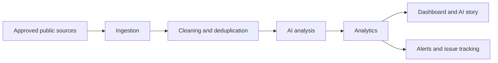

# Feedback Finder AI

AI-powered customer feedback intelligence platform for collecting permitted public feedback, classifying sentiment and complaint drivers, detecting emerging issues, and generating grounded business stories.

The first sprint is a telecom MVP built around AT&T, Verizon, T-Mobile, and Xfinity Mobile while keeping the core architecture domain-neutral.

## What This Repo Contains

- `apps/api` - FastAPI application and API routers.
- `apps/web` - Static dashboard prototype served by FastAPI.
- `apps/worker` - Worker entry point placeholder for scheduled ingestion and analysis jobs.
- `services` - Domain-neutral ingestion, AI analysis, analytics, search, and notification services.
- `connectors` - Source connector implementations, starting with a seeded public-feedback dataset connector.
- `domain-packs` - Industry taxonomies; telecom is implemented first.
- `shared` - Shared schemas, event contracts, security helpers, and observability helpers.
- `tests` - API, connector, classifier, and deduplication tests.
- `infrastructure` - Docker Compose and deployment-oriented configuration placeholders.

## Quick Start

```bash
python3 -m venv .venv
source .venv/bin/activate
python -m pip install -e ".[dev]"
uvicorn apps.api.main:app --reload
```

Open `http://127.0.0.1:8000` to view the dashboard.

## MVP Workflow



## API Examples

```bash
curl http://127.0.0.1:8000/api/health
curl http://127.0.0.1:8000/api/feedback
curl http://127.0.0.1:8000/api/analytics/overview
curl -X POST http://127.0.0.1:8000/api/assistant/ask \
  -H "Content-Type: application/json" \
  -d '{"question":"Why has AT&T customer sentiment declined during the past seven days?","company":"AT&T"}'
```

## Social and Community Source Collection

The platform includes connector scaffolding for:

- LinkedIn
- Facebook
- Instagram
- X
- Truth Social
- Reddit
- Telecom community forums

By default, `SOCIAL_CONNECTOR_MODE=mock` creates realistic telecom feedback records for local development. Production collection must be implemented through official APIs, approved exports, written permission, or platform-specific compliant access. Scraping is intentionally not implemented.

Trigger a local mock collection and vector indexing run:

```bash
curl -X POST http://127.0.0.1:8000/api/sources/social/collect \
  -H "Content-Type: application/json" \
  -d '{"mock":true,"query_terms":["AT&T","Verizon","T-Mobile","Xfinity Mobile"]}'
```

Search the local vector store:

```bash
curl -X POST http://127.0.0.1:8000/api/vector/search \
  -H "Content-Type: application/json" \
  -d '{"query":"fiber outage technician appointment Dallas","limit":5}'
```

The first implementation uses a deterministic local hashed embedding store at `data/vector_store.json`. It is meant as a swappable interface for Qdrant, Chroma, pgvector, OpenSearch vector search, or an existing enterprise vector database.

## Compliance Principles

Collection code must respect website terms, robots rules, API policies, rate limits, and privacy requirements. Feedback records retain source attribution and anonymized author references. PII masking belongs in the processing pipeline before records are used for analytics or summaries.
